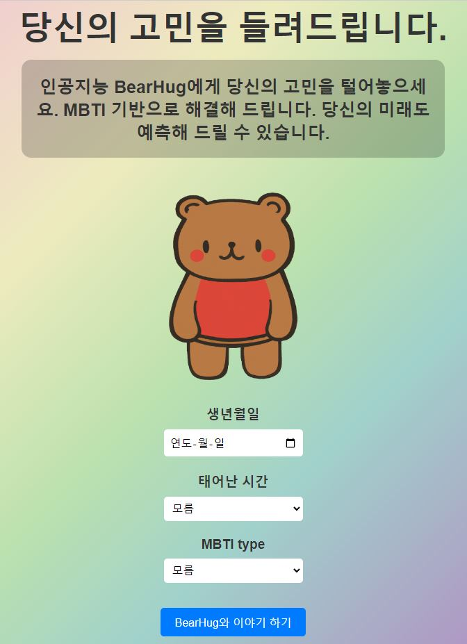
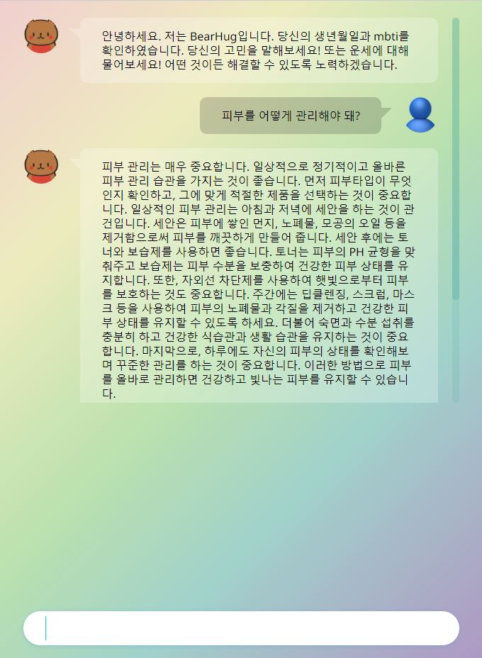
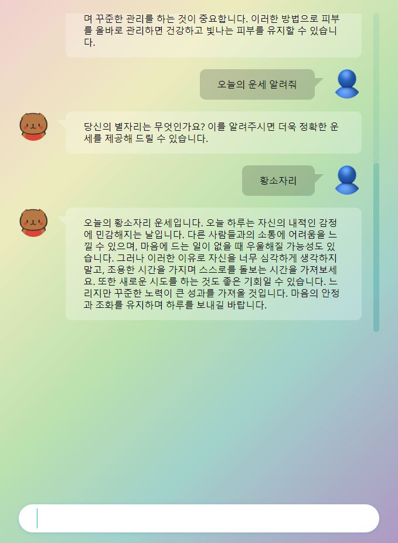

# BearHug with ChatGPT
 

> - *ChatGPT를 활용한 인공지능 고민 상담 채팅 사이트*

웹페이지는 [여기서](https://bearhug-ggooun.pages.dev) 확인할 수 있습니다.

## 목적
- ChatGPT API를 활용하여 본인의 MBTI를 기반으로 고민을 해결해 줄 수 있고 운세도 봐 줄 수 있는 인공지능 BearHug 개발

## 개요
- 적합한 고민상담을 위해 사용자의 MBTI 타입을 입력할 수 있음
- 보다 정확한 운세 예측을 위해 사용자가 생년월일, 태어난 시간을 입력할 수 있음
- BearHug와 대화할 수 있는 채팅 형식으로 구축

## 실행화면

<strong>웹페이지 메인화면</strong>

 

<strong>고민 물어보기</strong>

 

<strong>오늘의 운세 보기</strong>

 

## Contact
Should you have any question, please contact gooni0906@gmail.com.